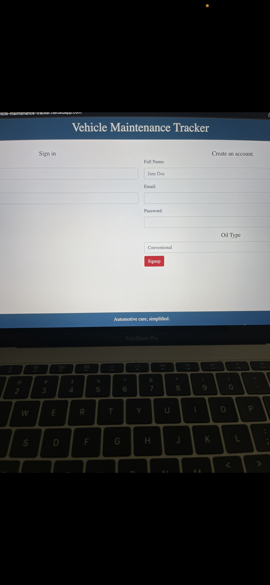

# Vehicle-Maintenance-Tracker
💻 Below is the picture of the application:
# screen shot 
 

 Application deployed live on https://vehicle-maintenance-tracker.herokuapp.com/

 
 
## Description
User can track time and mileage on their vehicle and then be given a time frame for their next maintenance check.
Display's a responsive front-end comprised of SASS and Handlebars.js, and a back end built with Node and MySQL2

## Table of Contents
- [Description](#description)
- [Installation](#installation)
- [Usage](#usage)
- [License](#license)
- [Contributing](#contributing)
- [Tests](#tests)
- [Questions](#questions)
## Installation
💾

npm init

npm install node

npm install express

npm install jest --save-dev

'heroku create

## Usage
💻

Express.js
Node.js
MySQL2
Insomnia
Heroku
Handlebars.js
Dotenv
BCrypt
Connect Session Sequelize
Express Session
node-sass
javascript
css
sass

## License

 
This application is covered by the MIT license. 
## Contributing
hugo Alvarado
olivia lammam
anais franco
## Tests
✏️ npm install jest --save-dev

## Questions
✋  email me or reach out on GitHub 
 
:octocat: Find me on GitHub: [rober2092](https://github.com/rober2092) 
 
✉️ Email me with any questions: rober2091@icloud.com  
_This README was generated with ❤️ by [vehicle-maintenance-tracker](https://github.com/Rober2092/Vehicle-Maintenance-Tracker) 🔥🔥🔥_
    